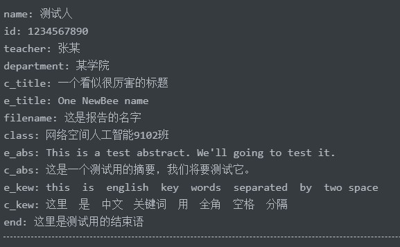
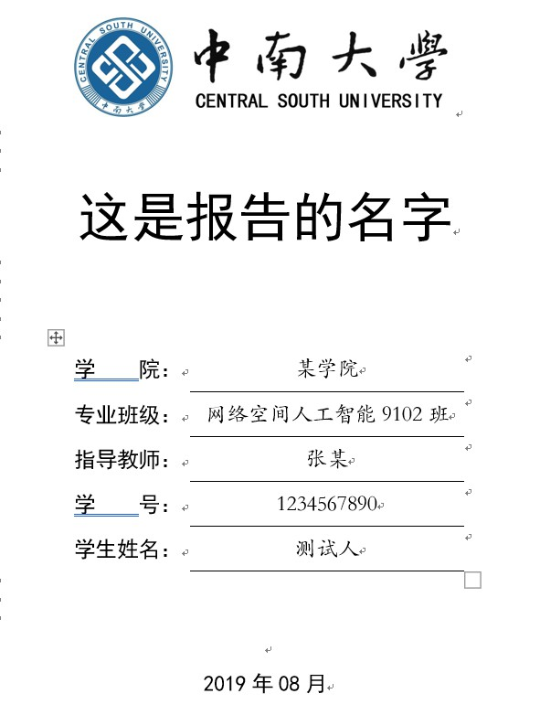

# Markdown定义

考虑需求，这里分为两部分，分别是按照markdown视角看parser用的语法，和按照报告的格式内容来看markdown的对应内容。

## markdown视角

### YAML头部

```markdown
---
key: value
---
```

需要注意的是，这个parser的YAML头部不允许值中有换行，也不允许有值是列表。（好菜的parser）

### 标题

语法为`#{1,3}title`，与GFM等标注相比需要注意的是中间没有空格。

标题中可以有粗体等特殊效果，支持的效果列表和正文一样。但是建议不要使用。

目前在把配置改成配置文件之前不考虑支持4级及以上的标题。

## 正文

和普通markdown一样，允许有嵌套、交错的加粗、斜体、删除线等。支持以下语法：

`**加粗**`**加粗**

`*斜体*`或者`_斜体_`*斜体*

`***加粗倾斜***`***加粗倾斜***

`~~删除线~~`删除线

`^上标^`^上标^

`下标`<sub>下标</sub>

```
`代码节`
```

`代码节`

### 引用

```
> 这里放引用
```

> 这里放引用

引用块将被渲染为参考文献，因为参考文献位于文件末尾而且前面有一个结束语，所以目前请保证文件中只有一个引用块并且被放置于末尾。同时，不支持嵌套。

### 暂时不支持的语法

#### 代码块

````c
```c
//这里面放代码
int main(int argc, char **argv){
  printf("Hello, World");
  return 0;
}
```
````

后续将会把这部分按照正文的代码片段进行渲染。

#### 水平分割线

用regex表示语法为`----*`

---

后续将会把水平分割线渲染为分页符。

#### 列表

无序列表

```
* Item 1
+ Item 2
- Item 3
```

* Item 1
+ Item 2
- Item 3

有序列表

```
7. Item 1
2. Item 2
5. Item 3
```

7. Item 1
2. Item 2
5. Item 3

#### 表格

```
some|header|labels
:---|:--:|---:
Left-justified|center-justified|right-justified
a|b|c
d|e|f
```

some|header|labels
:---|:--:|---:
Left-justified|center-justified|right-justified
a|b|c
d|e|f

#### 图片

```

```


#### 链接

```
[Wikipedia](http://en.wikipedia.org)

[Email](email@email.com)
```

[Wikipedia](http://en.wikipedia.org)

[Email](email@email.com)

#### EMOJI

`:smile:`

:smile:

## 报告视角

### 封面

封面的各信息均来自于yaml头部，对应关系参考下图





时间会自动采用生成时候的时间。

### 摘要

摘要是一个可选项，在yaml头部中定义c_abs、c_title、c_kew会自动生成中文的摘要，定义e_abs、e_title、e_kew。如果只需要其中的部分，也需要定义所有的键，否则会生成错误。

此外yaml头部不允许换行，也不允许列表。

### 目录

不需要自己写，将会自动在摘要（如果摘要不存在则是封面）之后生成。生成的默认内容是提示更新目录，只需点一下更新目录即可。

### 正文

使用正常markdown语法即可，需要注意的是`#`与标题内容之间不要有空格。

### 结束语

放在yaml头部的end键中，同样的，不要有换行。

### 参考文献

在文章末尾使用引用格式放出，例子如下

```
> [1]  王阳. 第三人称叙事的形式叙述者的限定[J]. 四川外语学院学报,2000(1):1-6.
>
> [2]  HAIMAN J. The Iconicity of Grammar[J]. Language,1980(56):515-540.
>
> [3]  陈牧. 拓扑绝缘体薄膜表面态和掺杂效应的STM研究[D]. 清华大学,2012.
```
